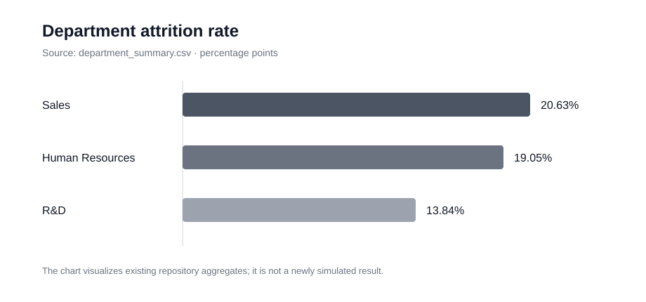
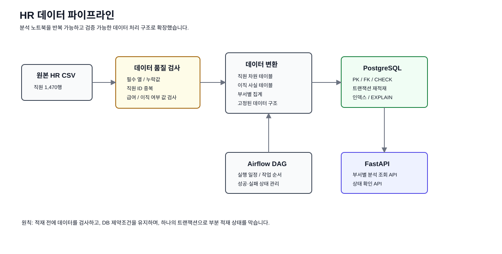
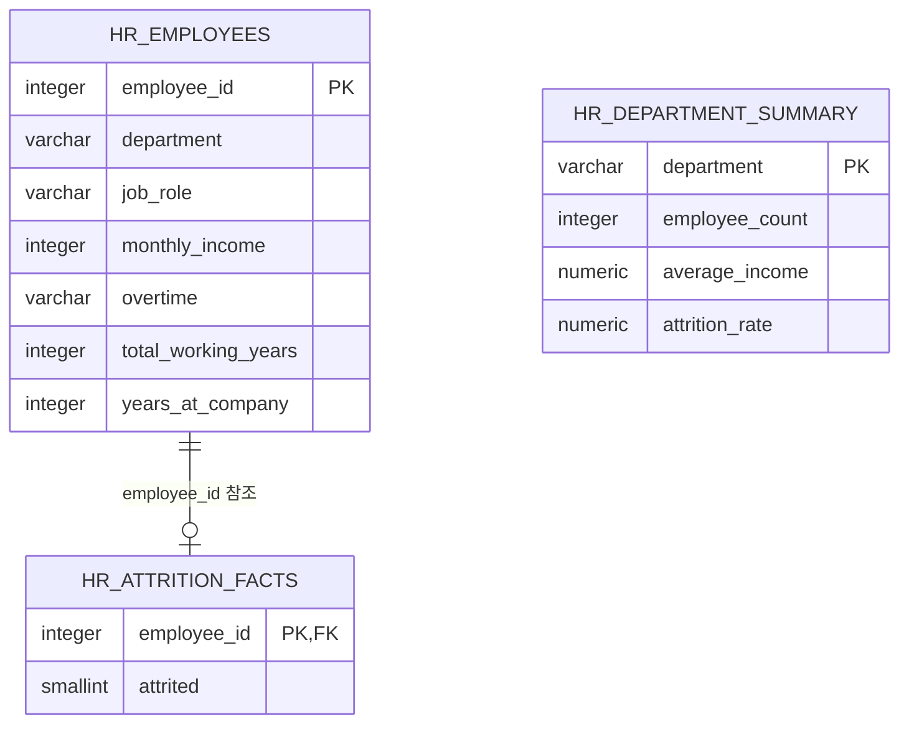

# HR Data Pipeline

노트북에서 분석하던 IBM HR 데이터를 반복해서 검증하고 적재할 수 있도록 Python 패키지, PostgreSQL, FastAPI로 확장한 개인 프로젝트입니다. Airflow DAG는 작업 의존 관계를 정의한 뼈대이며, 실제 ETL 함수 연결은 후속 과제입니다.

이 프로젝트의 핵심은 이직률 분석 결과 자체보다 **어떤 데이터가 들어와야 하는지, 잘못된 데이터는 어디서 막는지, DB에 어떻게 안전하게 적재하고 다시 같은 결과를 만들 수 있는지**를 코드로 설명하는 것입니다.

[개인 공부 기록](#개인-공부-기록--파일을-따라가며-정리하기) · [검증 근거와 재현 방법](docs/VERIFICATION.md)

---

## 1. 프로젝트 핵심

초기 프로젝트에서는 IBM HR 데이터를 노트북에서 정제하고 부서별 이직률, 급여, 업무 부담을 분석했습니다.

저장소의 실제 집계 결과:

| 부서 | 직원 수 | 평균 월급 | 이직률 |
|---|---:|---:|---:|
| Sales | 446 | 6,959.17 | **20.63%** |
| Human Resources | 63 | 6,654.51 | **19.05%** |
| Research & Development | 961 | 6,281.25 | **13.84%** |



하지만 노트북 중심 구조에는 다음 문제가 있었습니다.

1. 셀 실행 순서에 따라 결과가 달라질 수 있음
2. 잘못된 데이터가 들어와도 초기에 자동 차단되지 않음
3. 결과를 다른 서비스가 사용하려면 CSV나 노트북을 다시 직접 읽어야 함

그래서 CLI에서 다음 순서로 실행하는 구조로 바꿨습니다.

```text
원본 HR CSV
  ↓
데이터 품질 검사
  ├─ 필수 열 확인
  ├─ 직원 ID 중복 확인
  ├─ 잘못된 급여 값 확인
  ├─ 이직 여부 값 범위 확인
  └─ 필수값 누락 확인
  ↓
데이터 변환
  ├─ 직원 차원 테이블
  ├─ 이직 사실 테이블
  └─ 부서별 집계 테이블
  ↓
PostgreSQL 트랜잭션 적재
  ↓
FastAPI 조회 API
```

Airflow는 적재 결과를 전달받는 데이터 처리 단계가 아니라 배치 실행을 관리하도록 설계한 구성 요소입니다. 현재 DAG는 위 실행 경로를 호출하지 않습니다.

---

## 2. 왜 데이터 품질 검사를 앞에 두었는가

이직률 계산식이 맞더라도 원본 데이터가 잘못되어 있으면 결과를 신뢰할 수 없습니다.

예:
- 같은 `EmployeeNumber`가 두 번 존재
- `MonthlyIncome`이 음수
- `Attrition`에 `Yes/No`가 아닌 값 존재
- 필수 열 또는 필수값 누락

현재 검사 규칙:

| 검사 대상 | 실패 조건 | 목적 |
|---|---|---|
| 스키마 | 필수 열 누락 | 이후 변환 단계 오류 방지 |
| 직원 ID | `EmployeeNumber` 중복 | 동일 직원 중복 집계 방지 |
| 급여 | `MonthlyIncome < 0` | 비정상 값 차단 |
| 이직 여부 | `Yes/No` 외 값 | 이직 지표 정합성 유지 |
| 필수값 | NULL 존재 | DB 적재 전에 오류 발견 |

현재 필수 열은 `EmployeeNumber`, `Department`, `JobRole`, `MonthlyIncome`, `OverTime`, `Attrition`의 6개입니다. 변환에서 사용하는 `TotalWorkingYears`, `YearsAtCompany`는 이 검사에 포함되어 있지 않습니다. 또한 빈 입력, 숫자 자료형, 공백 문자열, `OverTime` 값의 범위까지 검증하지는 않습니다. 따라서 **검사 규칙을 구현했다는 것과 모든 잘못된 입력을 차단한다는 것은 구분**합니다.

검사에 실패한 행을 임의로 버리고 계속 진행하지 않습니다. 어느 값이 맞는지 시스템이 알 수 없는 경우에는 **파이프라인 전체를 실패시켜 원본 데이터를 확인하도록 하는 편이 안전하다**고 판단했습니다.

---

## 3. 분석 결과를 인과관계로 과장하지 않음

Sales 부서의 이직률이 다른 부서보다 높게 나타났지만, 이것만으로 특정 변수가 이직의 원인이라고 단정하지 않습니다.

이 데이터는 관찰 데이터이므로 분석 결과는 **추가 검증이 필요한 가설을 만드는 근거**로 사용합니다.

예를 들어 초과근무, 직무, 급여와 이직률 사이의 관계를 볼 수는 있지만 그것이 직접적인 원인이라는 결론에는 추가 실험이나 인과 분석이 필요합니다.

---

## 4. 데이터 모델

노트북에서는 하나의 DataFrame으로 사용하던 데이터를 조회 목적과 무결성 기준에 따라 세 테이블로 나눴습니다.

### `hr_employees`

직원의 비교적 안정적인 속성을 보관하는 **직원 차원 테이블**입니다.

```text
employee_id PK
department
job_role
monthly_income CHECK >= 0
overtime
total_working_years
years_at_company
```

### `hr_attrition_facts`

직원별 이직 여부를 보관하는 **이직 사실 테이블**입니다.

```text
employee_id PK/FK -> hr_employees
attrited CHECK IN (0, 1)
```

### `hr_department_summary`

API에서 자주 조회하는 부서별 집계 결과를 미리 저장합니다.

```text
department PK
employee_count
average_income
attrition_rate
```

원본 데이터를 그대로 한 테이블에 복사하기보다 **조회 목적과 무결성 경계를 명확하게 만들기 위해 분리**했습니다.

---

## 5. 왜 `to_sql(replace)`를 사용하지 않았는가

`pandas.to_sql(if_exists="replace")`는 편하지만 기존 테이블을 다시 만들기 때문에 PostgreSQL의 기본키, 외래키, CHECK 제약조건이 사라질 수 있습니다.

현재 방식은 DB 스키마를 먼저 만들고 하나의 트랜잭션 안에서 데이터를 다시 적재합니다.

```text
BEGIN
  기존 이직 사실 삭제
  기존 직원 삭제
  기존 부서 집계 삭제

  직원 데이터 적재
  이직 데이터 적재
  부서 집계 적재
COMMIT
```

중간에 하나라도 실패하면 전체를 롤백하므로 **일부 테이블만 새 데이터로 바뀐 상태를 남기지 않습니다.**

핵심은 데이터를 넣는 것보다 **DB 무결성 규칙을 유지한 채 적재하는 것**입니다.

---

## 6. FastAPI의 역할

FastAPI는 분석을 새로 수행하지 않고, **정제하고 집계한 결과를 다른 시스템이 조회할 수 있게 제공하는 역할**을 맡습니다.

### 상태 확인

```http
GET /health
```

현재는 고정된 `{"status": "ok"}`를 반환합니다. DB 연결과 적재 완료 여부를 확인하는 준비 상태 검사는 아닙니다.

### 부서별 요약

```http
GET /api/v1/departments
```

### 부서별 이직 정보

```http
GET /api/v1/departments/{department}/attrition
```

두 조회 API 모두 `hr_department_summary`를 읽습니다. 전체 목록은 이직률 내림차순이며, 단일 부서는 바인딩 매개변수로 조회합니다. 없는 부서는 현재 HTTP 200과 `{"department": "요청값", "found": false}`를 반환합니다. 이직률의 단위는 0~100 범위의 백분율입니다.

ETL과 API를 분리한 이유는 실행 특성이 다르기 때문입니다.

```text
ETL
→ 일정 주기로 실행 가능
→ 처리시간이 상대적으로 길어도 됨

조회 API
→ 짧고 안정적인 응답시간 필요
```

---

## 7. Airflow를 도입하려는 이유와 현재 구현 범위

초기에는 사람이 노트북을 직접 실행해야 했습니다.

```text
수동 노트북 실행
  ↓
실행 순서가 사람에게 의존
  ↓
정기 실행 / 실패 확인 / 재시도 필요
  ↓
Airflow로 작업 순서와 실행 상태 관리
```

Airflow를 도입하려는 목적은 **정해진 순서의 배치 작업을 반복 실행하고 실패 상태를 확인하는 것**입니다.

현재 `hr_pipeline_dag.py`에는 `quality_gate → transform → load` 의존 관계와 `0 7 * * *` 일정, `catchup=False`가 정의되어 있습니다. 그러나 각 태스크는 설명 문자열만 반환하며 CSV 읽기나 `run_pipeline()` 호출을 수행하지 않습니다. 재시도 횟수와 타임존도 명시하지 않았으므로 한국 시간 오전 7시 실행이나 재시도 동작을 보장한다고 설명하지 않습니다.

실제 실행 진입점은 `scripts/run_pipeline.py`입니다. `docker-compose.yml`도 PostgreSQL만 기동하며 Airflow 실행 환경은 제공하지 않습니다.

---

## 8. 왜 Kafka를 사용하지 않았는가

이 프로젝트의 데이터는 계속 들어오는 실시간 이벤트 흐름이 아니라 주기적으로 전체 데이터를 읽어 적재하는 배치 데이터입니다.

따라서 현재 핵심 문제는 이벤트 전달보다 **작업 순서, 데이터 품질, 적재 트랜잭션, 재현성**입니다.

여러 소비자가 실시간 이벤트를 독립적으로 처리해야 하는 요구가 생긴다면 Kafka 도입을 검토할 수 있습니다.

---

## 9. 인덱스 실험

`scripts/explain_indexes.sql`에서 PostgreSQL `EXPLAIN ANALYZE`로 인덱스 적용 전후를 비교할 수 있게 했습니다.

확인 항목:

```text
계획 시간
실행 시간
Seq Scan / Index Scan
읽은 행 수
```

인덱스가 있다고 무조건 빠른 것이 아니므로 실제 조회 조건과 데이터 크기에서 실행 계획을 확인합니다. 실측하지 않은 개선율은 README 성과로 적지 않습니다.

---

## 10. 장애 상황

### 중복 직원 ID

```text
원본 데이터
EmployeeNumber=10
EmployeeNumber=10
  ↓
데이터 품질 검사
  ↓
파이프라인 실패
```

어느 행이 맞는지 알 수 없기 때문에 자동 삭제하지 않습니다.

### DB 적재 중 실패

```text
직원 데이터 적재 성공
이직 데이터 적재 실패
  ↓
ROLLBACK
```

부분 성공 상태를 남기지 않습니다.

### 적재 중 API 조회

삭제와 삽입은 하나의 트랜잭션에 포함됩니다. 이번 검증에서는 적재 실패 후 기존 데이터가 보존되는 것을 확인했으며, 적재와 조회가 동시에 발생하는 부하·가용성 검증까지 수행하지는 않았습니다. 스테이징 테이블이나 버전별 스냅샷은 향후 데이터 규모와 갱신 요구에 따라 검토할 수 있습니다.

---

## 11. 테스트

현재 저장소의 자동 테스트는 다음 **4개**입니다.

| 파일 | 실제 검증하는 내용 |
|---|---|
| `tests/test_quality.py` | 정상 입력 통과, 중복 직원 ID 거절, `Attrition` 열 누락 예외를 확인합니다. |
| `tests/test_transform.py` | 4명 중 1명이 이직했을 때 이직률이 `25.0`인지 확인합니다. |

음수 급여, 잘못된 이직 값, 필수값 NULL, 직원·이직 테이블 변환, DB 롤백, API 조회는 기존 자동 테스트의 검증 범위에 포함되어 있지 않습니다. 이번 문서 검증에서 별도로 확인한 항목과 남은 과제는 [검증 기록](docs/VERIFICATION.md)에 구분했습니다.

GitHub Actions에서는 Python 3.11 기준으로 다음을 실행합니다.

```bash
python -m compileall -q src tests orchestration scripts
pytest -q
```

`compileall`은 문법 검사이며 Airflow 설치, DAG import, 스케줄 실행을 검증하지 않습니다. 현재 CI에는 PostgreSQL 서비스나 API 통합 테스트도 없습니다.

---

## 12. 운영에서 확인할 지표

실제 운영 단계로 확장한다면 다음 값을 관찰할 수 있습니다.

```text
파이프라인 성공 횟수
파이프라인 실패 횟수
품질 검사 거절 건수
원본 행 수
적재 행 수
전체 처리시간
API p95 지연시간
```

현재 구현에 없는 운영 관찰 시스템을 사용했다고 과장하지 않습니다.

---

## 13. 프로젝트 구조

```text
.
├── WA_Fn-UseC_-HR-Employee-Attrition.csv
├── first.ipynb
├── department.ipynb
├── strategy.ipynb
├── simul.ipynb
├── a.ipynb
├── department_summary.csv
├── department_means.csv
├── dept_attrition_significant_vars.csv
├── department_jobrole_salary_summary.csv
├── department_jobrole_workload_summary.csv
├── jobrole_workload_summary.csv
├── total.csv
├── src/hr_pipeline/
│   ├── __init__.py
│   ├── quality.py
│   ├── transform.py
│   ├── storage.py
│   ├── pipeline.py
│   └── api.py
├── orchestration/dags/
│   └── hr_pipeline_dag.py
├── scripts/
│   ├── run_pipeline.py
│   └── explain_indexes.sql
├── tests/
│   ├── test_quality.py
│   └── test_transform.py
├── docs/
│   ├── ARCHITECTURE_DECISIONS.md
│   ├── INTERVIEW_GUIDE.md
│   ├── VERIFICATION.md
│   └── assets/
│       ├── pipeline_architecture.svg
│       └── department_attrition.svg
├── .github/workflows/ci.yml
├── docker-compose.yml
├── requirements-airflow.txt
└── pyproject.toml
```

---

## 14. 실행

```bash
python -m venv .venv
source .venv/bin/activate
pip install -e '.[test]'
docker compose up -d
python scripts/run_pipeline.py
```

Windows PowerShell에서는 가상환경 생성 후 `source` 대신 `.\.venv\Scripts\Activate.ps1`을 사용합니다. PostgreSQL이 준비된 것을 `docker compose ps`에서 확인한 후 파이프라인을 실행합니다. 기본 연결 대상은 로컬 개발용 `localhost:5434/hr_pipeline`입니다.

다른 DB를 사용하실 때에는 CLI의 `--database-url`과 API의 `DATABASE_URL` 환경 변수를 같은 대상으로 지정하셔야 합니다. 현재 CLI는 `DATABASE_URL` 환경 변수를 직접 읽지 않습니다. 전체 재적재 방식이므로 실행 대상은 이 프로젝트 전용 DB로 지정합니다.

API 실행:

```bash
uvicorn hr_pipeline.api:app --app-dir src --reload
```

테스트:

```bash
pytest -q
```

---

## 15. 기존 프로젝트에서 바뀐 점

```text
기존
노트북
→ 수동 정제
→ CSV 집계
→ 발표 자료

현재
원본 CSV
→ 명시적인 데이터 품질 규칙
→ 재사용 가능한 Python 변환 코드
→ 제약조건이 있는 PostgreSQL
→ 트랜잭션 적재
→ FastAPI 조회 API
→ 자동 테스트

확장 예정
Airflow DAG 뼈대 → 실제 ETL 연결 및 스케줄 실행 검증
```

핵심 성과는 **분석 결과를 한 번 만드는 데서 끝나지 않고 같은 입력으로 같은 결과를 반복해서 만들 수 있는 구조로 바꾼 것**입니다.

---

## 16. 현재 한계

- 데이터는 1,470행 규모이며 대규모 처리 성능을 입증하지는 않았습니다.
- 전체 재적재 방식이며 CDC와 날짜별 이력 보관은 구현하지 않았습니다.
- Airflow는 DAG 뼈대 단계이며 실제 ETL 연결과 운영 검증이 필요합니다.
- API 인증과 DB 준비 상태 검사는 구현하지 않았습니다.
- 빈 입력 차단, 필수 열 계약 일치, 자료형 검증을 보완해야 합니다.
- DB·API 통합 검증을 CI로 옮기고 동시 실행·조회 상황을 검증해야 합니다.
- 인덱스 성능 개선율은 실측 근거가 없어 성과로 제시하지 않습니다.

기술을 많이 사용하는 것보다 문제 규모에 맞는 구조를 선택하는 것을 우선합니다.

---

## 설계 원칙

> **분석 결과의 정확성만큼 그 결과가 어떤 입력과 규칙으로 만들어졌는지 다시 재현할 수 있는지가 중요합니다.**

원본 데이터가 정해진 규칙을 통과한 경우에만 변환과 적재를 진행하고, 적재가 완료된 결과만 API로 제공합니다.

---

## 개인 공부 기록 — 파일을 따라가며 정리하기



**전체 처리 흐름은 원본 CSV 읽기 → 입력 검사 → 직원·이직·부서 집계로 변환 → PostgreSQL 트랜잭션 적재 → API 조회입니다.** 배치는 `scripts/run_pipeline.py`에서 시작하고, `pipeline.py`가 각 모듈을 호출합니다. API는 별도 프로세스로 실행하며 배치가 저장한 부서 집계를 읽습니다.

노트북은 데이터를 탐색하고 가설을 검토하는 분석 기록입니다. 현재 배치는 노트북의 결과 CSV를 다시 읽지 않고 원본 HR CSV에서 직접 출발합니다. Airflow는 이 배치를 정기적으로 실행하기 위한 DAG 뼈대까지 작성되어 있으며, 실제 처리 함수를 호출하는 연결은 남아 있습니다.

이 기록은 **각 파일의 역할을 데이터 흐름과 연결하고, 그 구조를 선택한 이유를 제 언어로 설명하기 위해** 정리했습니다. 계산 결과뿐 아니라 입력이 잘못되었을 때, 적재 도중 실패했을 때, 같은 파일을 다시 실행했을 때 어떤 일이 일어나는지도 함께 살펴보았습니다.

### 1. 먼저 원본 데이터 한 행을 따라가 보기

원본의 `EmployeeNumber=1`인 행에는 `Department=Sales`, `MonthlyIncome=5993`, `Attrition=Yes`가 들어 있습니다. 이 행이 조회 결과에 반영되는 과정을 따라가면 파일 사이의 관계를 이해하기 쉽습니다.

1. `run_pipeline.py`가 입력 파일 경로와 DB 주소를 받아 `pipeline.py`의 `run_pipeline()`을 호출합니다.
2. `pd.read_csv()`가 파일 전체를 DataFrame으로 읽습니다. DataFrame은 열 이름을 가진 표 형태의 데이터라고 이해했습니다.
3. `quality.py`가 필수 열, 중복 직원 ID, 음수 급여, 이직 값, 필수값 누락을 검사합니다. 이 단계는 한 행만이 아니라 입력 전체를 대상으로 합니다.
4. `transform.py`가 직원 속성을 `employee_id=1`인 직원 행으로 만들고, 이직 여부는 `attrited=1`로 변환합니다. 이 직원은 Sales의 인원과 이직자 수에 각각 한 명씩 포함됩니다.
5. `pipeline.py`가 세 테이블의 기존 데이터를 지우고 새 결과를 하나의 트랜잭션으로 적재합니다. 이 직원만 개별 갱신하는 방식은 아닙니다.
6. `api.py`가 Sales의 집계를 조회하면 직원 446명, 이직률 약 20.63%가 반환됩니다. 이 비율의 분모는 Sales 직원 446명이고 분자는 이직자 92명입니다.

처음에는 이직률 계산식에 집중하기 쉬웠지만, 코드를 따라가면서 **직원 한 명을 구분하는 기준과 집계의 분모가 먼저 명확해야 결과도 설명할 수 있다**는 점을 정리했습니다. 전체 직원의 이직률과 부서별 이직률, 전체 이직자 중 특정 부서의 비중은 서로 다른 지표입니다.

### 2. 실행과 설정 파일

#### [`pyproject.toml`](pyproject.toml) — 프로젝트를 실행할 환경과 의존성

Python 3.11 이상이라는 실행 조건과 필요한 라이브러리, pytest의 검사 경로를 선언합니다. pandas는 표 데이터 처리, SQLAlchemy는 DB 연결과 SQL 실행, psycopg는 PostgreSQL 접속을 담당합니다. FastAPI는 HTTP API를 정의하고 Uvicorn은 그 API를 실행하는 서버입니다.

`pip install -e '.[test]'`에서 `-e`는 현재 소스를 수정한 내용이 설치된 패키지에 반영되도록 하는 개발용 설치 방식이고, `[test]`는 테스트에 필요한 추가 의존성을 함께 설치하겠다는 뜻입니다. 라이브러리 이름을 나열하는 것에서 더 나아가, 각 라이브러리가 처리 흐름의 어느 부분을 맡는지 연결해서 읽었습니다.

현재 버전 설정은 허용 범위이며 모든 버전을 정확히 고정한 파일은 아닙니다. 또한 노트북의 matplotlib, seaborn, statsmodels, scikit-learn은 이 파일의 의존성에 포함되어 있지 않습니다. **배치 패키지가 설치되는 것과 모든 분석 노트북을 실행할 환경이 준비되는 것은 별개**입니다.

#### [`docker-compose.yml`](docker-compose.yml) — 로컬 PostgreSQL 실행

PostgreSQL 17 Alpine 컨테이너와 개발용 계정, 포트, 상태 확인 방법을 정의합니다. `5434:5432`는 로컬 PC의 5434번 포트를 컨테이너 내부 DB의 5432번 포트로 연결한다는 뜻입니다.

Python 배치와 API, Airflow는 이 파일에 포함되지 않아 따로 실행해야 합니다. 현재 기본 DB 주소의 `localhost`도 Python을 로컬 PC에서 실행하는 구성을 전제로 합니다. Python을 나중에 컨테이너로 옮기면 그 컨테이너의 `localhost`는 자기 자신이므로 연결 주소를 다시 설정해야 합니다.

`pg_isready`는 DB의 연결 수락 상태를 확인합니다. 이 검사가 성공했다고 HR 테이블 적재까지 완료된 것은 아닙니다. 명시적인 named volume도 정의하지 않았으므로 데이터를 계속 보관하려면 컨테이너 수명과 저장소 구성을 함께 살펴봐야 합니다.

#### [`scripts/run_pipeline.py`](scripts/run_pipeline.py) — 배치를 시작하는 진입점

`argparse`로 `--source`와 `--database-url`을 읽고 `run_pipeline()`을 호출합니다. 실행 결과로 품질 보고서와 직원·부서 행 수를 출력합니다. 이 파일이 계산 로직까지 직접 갖지 않도록 구성하여 명령행에서 실행하는 방식과 실제 데이터 처리 함수를 분리했습니다.

기본 입력 경로는 실행한 폴더를 기준으로 해석되므로 명령은 저장소 루트에서 실행합니다. CLI는 `--database-url`을 사용하지만 API는 `DATABASE_URL` 환경 변수를 읽습니다. 두 설정을 서로 다르게 지정하면 배치는 한 DB에 적재하고 API는 다른 DB를 조회할 수 있다는 점도 확인했습니다.

#### [`src/hr_pipeline/__init__.py`](src/hr_pipeline/__init__.py) — Python 패키지의 경계

`hr_pipeline` 패키지의 `__all__`을 선언합니다. `__all__`은 별표 import에서 공개할 이름을 정하는 설정이며, 여기에 포함되지 않은 모듈의 명시적 import를 막는 접근 제어는 아닙니다. 이 파일 자체가 배치를 실행하거나 DB를 초기화하지는 않습니다.

### 3. 입력 검사부터 DB 적재까지 담당하는 파일

#### [`quality.py`](src/hr_pipeline/quality.py) — 계산 전에 입력을 신뢰할 수 있는지 확인

`validate_frame()`은 입력 데이터가 지켜야 할 규칙을 검사합니다. 필수 열이 없으면 이후 계산 자체가 불가능하므로 즉시 예외를 발생시킵니다. 열이 존재할 때는 중복 ID, 음수 급여, 잘못된 이직 값, 필수값 누락을 세어 `QualityReport`로 반환합니다.

`@dataclass(frozen=True)`는 검사 결과를 필드로 묶고 생성 후 필드 재할당을 막습니다. `passed`는 네 가지 오류 집계가 모두 0인지 판단하는 속성입니다. `missing_required_values`는 빈 셀 수가 아니라 **필수값이 하나라도 누락된 행 수**이고, 중복 ID 수는 첫 번째 행을 제외한 추가 중복 행 수입니다.

중복 행을 자동으로 삭제하지 않는 이유는 같은 ID의 두 행 중 어느 쪽이 올바른지 알 수 없기 때문입니다. 한 행을 임의로 버리면 직원 수와 이직률이 달라져도 작업은 성공한 것처럼 보일 수 있습니다. 현재 규모에서는 원본을 확인하도록 전체 작업을 중단하는 쪽을 선택했습니다.

검증하면서 입력 계약의 공백도 확인했습니다. 변환에서 필요한 `TotalWorkingYears`, `YearsAtCompany`가 필수 열 목록에 없고, 같은 열을 가진 빈 입력도 통과합니다. 검사 함수가 있다는 사실만으로 충분하지 않으며, **뒤에서 사용하는 열과 자료형, 허용할 행 수까지 계약이 맞아야 한다**는 점을 배웠습니다.

#### [`transform.py`](src/hr_pipeline/transform.py) — 같은 입력에 같은 계산 규칙 적용

이 파일의 세 함수는 DataFrame을 받아 변환 결과를 반환합니다. 파일을 읽거나 DB에 쓰는 작업이 없어 작은 예제 데이터만으로 계산을 확인할 수 있습니다. 입력·출력과 계산 규칙을 분리하면 노트북 전체를 실행하지 않고도 특정 변환을 살펴볼 수 있습니다.

`build_employee_dimension()`은 직원 속성 7개를 선택하고 `EmployeeNumber → employee_id`처럼 DB 열 이름으로 바꿉니다. 차원 테이블은 여기서 직원의 부서·직무·급여 같은 속성을 담는 표라고 이해했습니다.

`build_attrition_fact()`는 직원 ID와 이직 여부를 만듭니다. `Attrition == "Yes"`의 결과를 정수로 바꾸기 때문에 `Yes`가 아닌 값은 모두 0이 됩니다. 따라서 `Unknown` 같은 잘못된 값은 반드시 앞선 품질 검사에서 거절해야 합니다. **함수의 결과가 맞으려면 호출 전에 어떤 조건이 충족되어야 하는지도 함께 읽어야 합니다.**

`build_department_summary()`는 부서별 직원 수, 평균 월급, 이직률을 계산합니다. 0과 1로 바꾼 이직 값의 평균은 이직 비율이고, 여기에 100을 곱해 API에서 사용하는 백분율로 만듭니다. 예를 들어 4명 중 1명이 이직하면 `0.25`가 아니라 `25.0`을 저장합니다.

부서별 이직률을 다시 단순 평균하면 전체 이직률이 되지 않을 수 있습니다. 부서마다 직원 수가 다르기 때문에 전체 지표를 만들 때는 이직자 수와 직원 수를 합쳐 다시 계산해야 합니다.

#### [`storage.py`](src/hr_pipeline/storage.py) — DB 연결과 데이터 무결성 규칙

`build_engine()`은 SQLAlchemy 엔진을 만듭니다. 엔진은 DB 연결을 확보하고 SQL을 실행하는 출발점입니다. `pool_pre_ping=True`는 연결을 사용할 때 유효성을 확인하는 설정이며, 실패한 배치 전체를 자동 재실행하는 기능은 아닙니다.

`bootstrap_schema()`는 세 테이블을 준비합니다. 직원 ID의 기본키는 같은 직원의 중복 저장을 막고, 이직 테이블의 외래키는 없는 직원을 참조하지 못하게 합니다. CHECK 제약조건은 음수 급여와 0·1 이외의 이직 값을 막습니다. 애플리케이션 검사가 적재 전에 오류를 설명한다면, DB 제약조건은 실제 저장 단계의 무결성을 지킵니다.



직원 테이블과 이직 테이블은 정상 적재 결과에서 직원 한 명당 한 행씩 대응합니다. 다만 외래키만으로 모든 직원에게 이직 행이 반드시 존재하도록 강제하지는 않습니다. 부서 집계는 원본에서 별도로 계산하는 조회용 표이고 다른 두 테이블과 외래키로 연결되어 있지 않습니다.

현재는 날짜나 이력 버전을 저장하지 않아 최신 스냅샷을 표현합니다. 스냅샷은 한 번의 입력 파일이 보여 주는 전체 상태라는 뜻입니다. 이직 테이블을 분리했다고 월별 이직 이력까지 저장하는 모델이 되는 것은 아닙니다.

또한 `CREATE TABLE IF NOT EXISTS`는 테이블이 없을 때만 생성합니다. 이미 있는 테이블의 열이나 제약조건을 새 코드에 맞게 바꾸지 않으므로, 이후 스키마 변경에는 별도의 마이그레이션 관리가 필요합니다.

#### [`pipeline.py`](src/hr_pipeline/pipeline.py) — 처리 순서와 트랜잭션 경계를 연결

각 모듈을 실제 실행 흐름으로 묶는 파일입니다. 원본을 읽고 품질 검사에 실패하면 DB 엔진을 만들기 전에 중단합니다. 검사에 통과하면 세 DataFrame을 만든 뒤 스키마를 준비하고 데이터를 적재합니다.

적재는 `with engine.begin() as connection:` 안에서 수행합니다. 정상 종료하면 커밋하고 도중에 예외가 발생하면 롤백합니다. 삭제할 때는 직원을 참조하는 이직 행을 먼저 지우고, 삽입할 때는 참조 대상인 직원 행을 먼저 넣습니다. 이 순서는 외래키 관계 때문에 필요합니다.

처음에는 기존 테이블을 새 DataFrame으로 교체하면 간단해 보일 수 있습니다. 하지만 `to_sql(if_exists="replace")`로 테이블을 다시 만들면 선언해 둔 제약조건을 잃을 수 있습니다. 그래서 스키마를 유지한 채 기존 행을 삭제하고 `append`로 넣는 방식을 사용합니다. **최종 동작은 전체 재적재이며, 기존 데이터 뒤에 계속 누적하는 방식은 아닙니다.**

파일 읽기와 계산은 적재 트랜잭션 밖에서 처리합니다. DB 변경에 필요한 구간을 묶되 파일 처리 시간까지 트랜잭션을 유지하지 않기 위해서입니다. 스키마 생성은 별도 트랜잭션이므로 첫 적재가 실패하면 빈 테이블은 남을 수 있습니다.

같은 원본을 두 번 실행한 뒤 세 테이블의 전체 내용을 비교해 동일한 것을 확인했습니다. 여기서 재실행의 안전성은 최종 저장 내용이 같다는 의미입니다. 작업 자체를 생략하거나 과거 실행 이력을 보관한다는 뜻은 아닙니다. 여러 배치를 동시에 실행하는 경우는 별도 검증이 필요합니다.

### 4. 결과 조회와 실행 관리를 담당하는 파일

#### [`api.py`](src/hr_pipeline/api.py) — 계산해 둔 결과를 다른 프로그램에 제공

FastAPI에 세 조회 경로를 등록합니다. `/api/v1/departments`는 부서 집계를 이직률 내림차순으로 반환하고, `/api/v1/departments/{department}/attrition`은 지정한 부서의 집계 한 행을 반환합니다. 두 경로 모두 `hr_department_summary`를 읽습니다.

API 요청마다 CSV를 읽고 다시 집계하지 않도록 배치 처리와 조회를 분리했습니다. 이 구조에서 조회 결과의 최신성은 마지막 배치의 성공 시점에 달려 있습니다. 원본 파일을 바꾸는 것만으로 API 결과가 갱신되지는 않습니다.

부서 이름은 SQL 문장에 직접 이어 붙이지 않고 `:department` 매개변수로 전달합니다. 사용자가 전달한 값을 SQL 문법과 분리해서 처리하기 위한 방식입니다.

현재 없는 부서는 HTTP 200과 `found: false`로 응답합니다. `/health`도 고정된 `{"status": "ok"}`를 반환하므로 DB 준비 상태를 확인하는 기능은 아닙니다. 응답이 온다는 사실과 데이터를 정상적으로 조회할 수 있다는 사실을 구분해서 확인해야 합니다.

#### [`orchestration/dags/hr_pipeline_dag.py`](orchestration/dags/hr_pipeline_dag.py) — 정기 실행을 위한 작업 관계

DAG는 작업과 작업 사이의 의존 관계를 표현합니다. 현재 `quality_gate → transform → load` 순서와 `0 7 * * *` 일정, `catchup=False`가 정의되어 있습니다. `catchup=False`는 과거의 누락된 스케줄 구간을 자동으로 모두 실행하지 않도록 하는 설정입니다.

다만 세 태스크는 설명 문자열만 반환하며 `run_pipeline()`이나 실제 처리 함수를 호출하지 않습니다. 타임존과 재시도 횟수도 명시하지 않아 한국 시간 오전 7시 실행이나 재시도 정책을 구현했다고 설명하지 않습니다. [`requirements-airflow.txt`](requirements-airflow.txt)는 Airflow 버전을 별도로 선언하지만 기본 패키지 설치와 현재 CI에서는 설치하지 않습니다.

다음 단계에서는 기존 파이프라인을 하나의 태스크에서 호출하는 방식을 먼저 검토하겠습니다. 품질 검사·변환·적재를 각각의 태스크로 나누면 중간 데이터 저장 위치와 재시도 기준도 정해야 합니다. Python 함수를 여러 태스크로 나누는 것만으로 안정적인 실행 관리가 완성되지는 않는다는 점을 정리했습니다.

#### [`scripts/explain_indexes.sql`](scripts/explain_indexes.sql) — 인덱스의 효과를 확인하기 위한 실험

Sales 부서 이직자의 직무별 평균 급여를 조회하고, `(department, job_role)` 인덱스를 만든 뒤 같은 조회의 실행 계획을 다시 확인합니다. `EXPLAIN (ANALYZE, BUFFERS)`는 실제로 쿼리를 실행하며 계획과 실행 통계, 버퍼 접근 정보를 보여 줍니다.

인덱스는 읽을 범위를 줄일 수 있지만 저장 공간과 쓰기 비용이 추가됩니다. 데이터가 작거나 조회하는 행이 많으면 순차 탐색이 더 유리할 수도 있으므로, 인덱스가 생겼다는 사실보다 어떤 계획이 선택됐는지 확인해야 합니다.

이 SQL은 API가 사용하는 부서 집계 조회와는 다른 쿼리입니다. 또 한 번 실행한 뒤에는 인덱스가 남기 때문에 재실행의 첫 조회를 인덱스 없는 기준값으로 볼 수 없습니다. 현재 성능 개선율을 측정한 기록은 없으며 비교 조건부터 맞추는 것이 다음 실험의 출발점입니다.

### 5. 분석 노트북과 CSV를 읽으며 정리한 내용

#### [`first.ipynb`](first.ipynb) — 데이터의 의미와 분석 가설 탐색

직원 분포, 이직 여부, 나이, 만족도, 근속연수 등을 살펴보고 로지스틱 회귀를 실험한 초기 분석 기록입니다. 어떤 열이 식별자이고 어떤 열이 비교할 특성인지 구분하는 데서 분석이 시작됩니다.

회귀 결과를 읽을 때 `exp(계수)`는 확률의 배수가 아니라 오즈비라는 점을 다시 정리했습니다. p값이 크다는 이유만으로 영향이 없다고 단정할 수도 없습니다. 관찰된 관계는 추가 검증할 가설의 근거로 사용해야 합니다.

저장된 마지막 셀 출력에는 `df`가 정의되지 않았다는 오류가 남아 있습니다. 이번에는 셀 소스와 저장된 출력을 검토했으며 노트북 전체를 초기 상태에서 재실행하지는 않았습니다. 저장된 그림이 있다는 사실만으로 처음부터 같은 결과를 재현할 수 있다고 판단하지 않습니다.

#### [`department.ipynb`](department.ipynb) — 부서별 지표와 직무별 집계

부서별 인원, 급여, 이직률과 초과근무·직무별 분포를 분석합니다. 부서별 로지스틱 회귀와 합성 점수 실험도 포함하며, 부서 요약과 급여 요약 CSV를 생성하는 주요 파일입니다.

코드를 읽으면서 같은 출력 파일을 여러 셀에서 서로 다른 열 구성으로 저장하는 부분을 확인했습니다. 예를 들어 `department_jobrole_salary_summary.csv`는 실행한 마지막 셀에 따라 포함되는 열이 달라질 수 있습니다. 노트북의 유연함이 반복 실행에서는 숨은 의존 관계가 될 수 있는 사례입니다.

반복 처리 코드에서는 `transform.py`가 선택할 열과 계산할 지표를 명시합니다. 탐색 과정의 모든 실험을 그대로 자동화하기보다, 다시 실행해야 하는 계산의 입력과 출력을 먼저 고정하는 이유를 이해했습니다.

#### [`strategy.ipynb`](strategy.ipynb) — 분석 지표를 비교하고 해석

부서·직무별 급여 요약을 읽어 이직률과 평균 급여, 초과근무 여부에 따른 차이를 비교합니다. 월 근무시간과 야근 횟수·시간을 가정하는 계산도 포함합니다.

이미 집계된 직무별·부서별 비율을 단순 평균하는 부분은 원본 직원 전체로 계산한 비율과 다를 수 있습니다. **그룹별 평균을 다시 평균하기 전에 각 그룹의 인원수가 같은지 확인해야 합니다.** 전략을 제안하는 그래프일수록 분모와 가정을 함께 적어야 판단의 근거가 분명해집니다.

이 노트북은 비교와 가설 검토의 기록입니다. 제안한 정책을 적용해서 실제 이직률이나 비용이 줄어든 결과를 측정한 것은 아닙니다.

#### [`simul.ipynb`](simul.ipynb) — 교체 비율이 근속연수 분포에 미치는 영향 실험

인원 1,000명에서 매 턴 일정 비율을 무작위로 교체하고 신규 인원을 충원하는 실험입니다. 15턴을 1,000회 반복하며, 교체 비율 38%와 17%인 경우를 비교합니다. 난수 시드는 42로 고정합니다.

시드는 같은 조건의 난수 실험을 다시 살펴보기 위한 설정입니다. 반복 횟수가 많아도 가정이 실제 조직을 잘 설명하는지는 별도 문제입니다. 특히 38%와 17%는 실험에 넣은 값이므로 이 프로젝트가 이직률을 그만큼 낮췄다는 성과로 해석하지 않습니다.

#### [`a.ipynb`](a.ipynb) — 급여와 업무량 자료를 연결

업무량 지표를 시각화하고 급여 집계와 업무량 집계를 `Department`, `JobRole` 두 열로 결합하여 `total.csv`를 만듭니다. `how="outer"`는 어느 한쪽에만 있는 부서·직무 조합도 남기는 외부 결합입니다. 한쪽에 대응하는 행이 없으면 결과에 누락값이 생길 수 있습니다.

이후 업무량을 인원수로 나누거나 추가 인원에 평균 급여를 곱해 비교합니다. 조인 결과의 행 수와 키 중복, 누락값을 확인하지 않으면 계산이 가능해 보여도 지표가 잘못될 수 있다는 점에 주목했습니다.

업무량 CSV의 최초 생성 코드는 현재 저장소에서 확인되지 않았습니다. 이 분석을 끝까지 재현하려면 업무량과 추가 인원 지표의 정의, 생성 코드, 가정의 근거를 먼저 보완해야 합니다.

#### 원본과 분석 산출물 — 이름이 비슷해도 사용 경로가 다릅니다

- [`WA_Fn-UseC_-HR-Employee-Attrition.csv`](WA_Fn-UseC_-HR-Employee-Attrition.csv)는 현재 ETL의 원본입니다. 1,470행·35열이며 부서 3개와 직무 9개를 포함합니다.
- [`department_summary.csv`](department_summary.csv)는 부서별 인원·총월급·평균월급·이직률을 담은 3행의 분석 결과입니다. 현재 변환 함수로 다시 계산한 인원·평균월급·이직률과 일치하는지 확인했습니다.
- [`department_means.csv`](department_means.csv)는 부서별 수치형 변수 평균입니다. 직원 ID도 숫자형이지만 ID의 평균이 분석상 유용한 것은 아니므로 열의 의미를 먼저 확인합니다.
- [`department_jobrole_salary_summary.csv`](department_jobrole_salary_summary.csv)는 부서·직무 조합 11개에 대한 급여와 인원, 잔류·이직·초과근무별 지표입니다. `strategy.ipynb`와 `a.ipynb`에서 읽습니다.
- [`dept_attrition_significant_vars.csv`](dept_attrition_significant_vars.csv)는 부서별 회귀의 계수·p값·신뢰구간 등을 담은 23행의 분석 기록입니다. 별도 검증 데이터에서의 예측 성능을 나타내는 파일은 아닙니다.
- [`jobrole_workload_summary.csv`](jobrole_workload_summary.csv)는 직무 9개, [`department_jobrole_workload_summary.csv`](department_jobrole_workload_summary.csv)는 부서·직무 조합 11개의 업무량·추가 인원·비용 지표입니다. 두 파일 모두 생성 경로 보완이 필요합니다.
- [`total.csv`](total.csv)는 `a.ipynb`에서 급여와 업무량을 결합한 11행의 결과입니다. DB 적재 입력이나 API 조회 원본은 아닙니다.

### 6. 테스트와 문서 파일을 읽는 기준

#### [`tests/test_quality.py`](tests/test_quality.py) — 입력 검사 규칙 확인

현재 자동 테스트는 정상 입력 통과, 중복 ID 거절, `Attrition` 열 누락의 세 사례입니다. 작은 DataFrame을 만들어 함수의 결과를 빠르게 확인합니다.

검사 코드에 음수 급여와 NULL 조건이 있다고 해서 그 조건의 자동 테스트도 존재하는 것은 아닙니다. 구현한 규칙, 자동으로 검사하는 사례, 별도로 실행해서 확인한 사례를 구분해 읽었습니다.

#### [`tests/test_transform.py`](tests/test_transform.py) — 이직률의 단위 확인

4명 중 1명이 이직한 입력에서 `attrition_rate=25.0`인지 확인합니다. 계산이 실행되는지만 보는 것이 아니라 API에 전달할 숫자의 단위를 고정하는 테스트입니다.

현재 이 파일은 직원 열 이름 변환, 이직 사실 변환, 평균 급여, 여러 부서의 집계까지 검사하지는 않습니다. 따라서 기존 테스트 4개의 통과만으로 파이프라인 전체가 검증되었다고 설명하지 않습니다.

#### [`.github/workflows/ci.yml`](.github/workflows/ci.yml) — 변경할 때마다 같은 검사 반복

push, pull request, 수동 실행 시 Python 3.11 환경을 준비하고 패키지 설치, `compileall`, pytest를 실행하도록 설정되어 있습니다. `compileall`은 Python 문법을 검사하지만 DB 연결이나 Airflow DAG의 실제 실행을 확인하지는 않습니다.

현재 CI에는 PostgreSQL 서비스와 API 통합 테스트가 없습니다. 이번에 별도 DB에서 확인한 재적재와 롤백을 CI에도 포함하면 이후 수정이 같은 보장을 깨뜨리는지 지속적으로 확인할 수 있습니다.

#### 설계 문서와 그림 — 설명을 코드의 근거와 연결

- [`docs/ARCHITECTURE_DECISIONS.md`](docs/ARCHITECTURE_DECISIONS.md)는 어떤 문제 때문에 해당 방식을 선택했고 어떤 비용이 남는지 정리합니다.
- [`docs/INTERVIEW_GUIDE.md`](docs/INTERVIEW_GUIDE.md)는 설명을 연습하는 보조 자료입니다. 답변에 나오는 동작을 실제 파일과 검증 결과로 다시 확인합니다.
- [`docs/VERIFICATION.md`](docs/VERIFICATION.md)는 검증 환경, 실패 주입 방법, 결과, 재현 코드를 기록합니다.
- [`docs/assets/pipeline_architecture.svg`](docs/assets/pipeline_architecture.svg)는 처리 흐름과 파일 역할을 연결합니다. [`docs/assets/department_attrition.svg`](docs/assets/department_attrition.svg)는 부서별 이직률을 표현한 정적 그림입니다. 구현이나 데이터가 바뀌면 그림도 함께 갱신해야 합니다.
- [`README.md`](README.md)는 실행 방법, 설계 이유, 학습 기록을 모아 둔 진입 문서입니다. 자세한 검증 절차는 별도 문서로 연결해 전체 흐름을 먼저 읽을 수 있도록 구성했습니다.

### 7. 이 구조로 해결한 문제와 확인한 결과

**첫 번째는 분석을 반복하는 방법입니다.** 노트북의 셀 상태에 의존하던 계산 중 반복할 부분을 함수와 CLI로 분리했습니다. 같은 원본 1,470행을 두 번 적재하고 직원 1,470행, 이직 정보 1,470행, 부서 집계 3행의 전체 내용이 같음을 확인했습니다. 한 번의 분석 결과를 반복해서 만들 수 있는 실행 경로로 정리한 것이 성과입니다.

**두 번째는 잘못된 입력을 발견하는 시점입니다.** 중복 직원 ID, 음수 급여, 잘못된 이직 값, 필수값 NULL을 각각 넣었을 때 DB 엔진 생성 전에 작업이 실패하는지 확인했습니다. DB에 쓰기 시작하기 전에 오류를 드러내도록 처리 순서를 정했습니다. 빈 입력과 누락된 근속연수 열 검사는 다음 보완 항목으로 남아 있습니다.

**세 번째는 적재 도중 실패했을 때의 일관성입니다.** 정상 데이터를 적재한 뒤 이직 값에 `2`를 주입해 CHECK 위반을 발생시켰습니다. 직원 삽입 이후 오류가 나더라도 세 테이블의 기존 내용이 모두 보존되는 것을 확인했습니다. 트랜잭션을 사용했다는 설명을 실제 실패 상황에서 확인한 결과로 연결했습니다.

**네 번째는 결과를 사용하는 방법입니다.** FastAPI로 부서 목록과 Sales 집계를 조회하고 원본 계산과 맞는지 확인했습니다. 다른 프로그램이 노트북을 실행하거나 CSV 구조를 직접 해석하지 않고 HTTP로 결과를 받을 수 있는 경로를 마련했습니다.

이 과정에서 얻은 가장 큰 학습은 **계산식의 정확성, 입력 계약, 실패 시 복구, 조회 결과의 의미를 하나의 흐름으로 설명해야 한다는 점**입니다. 실제 조직의 이직률 감소나 비용 절감, 처리속도 개선율은 측정하지 않았으며 위의 재현성과 데이터 일관성을 확인한 결과로 성과를 설명합니다.

### 8. 스스로 다시 설명해 볼 질문

- `quality.py`의 검사와 DB의 PK·FK·CHECK는 각각 어느 시점에 무엇을 막습니까?
- 이직 값을 변환할 때 품질 검사를 먼저 하지 않으면 어떤 잘못된 값이 0으로 바뀔 수 있습니까?
- `to_sql()`에 `append`를 사용하면서도 전체 재적재 방식이라고 부르는 이유는 무엇입니까?
- 직원 삽입은 성공하고 이직 정보 삽입이 실패하면 기존 데이터는 어떻게 됩니까?
- 같은 입력의 재실행 결과가 같다는 것과 날짜별 이력을 보관한다는 것은 어떻게 다릅니까?
- 부서별 이직률을 단순 평균하면 전체 이직률과 달라질 수 있는 이유는 무엇입니까?
- `/health`와 단위 테스트가 정상이어도 DB 조회나 Airflow 배치 실행은 실패할 수 있습니까?

답을 외우기보다 해당 파일을 열어 입력, 처리 순서, 실패 조건과 결과를 따라 설명할 수 있는지 확인합니다.

### 9. 직접 실행하며 확인하는 순서

Python 3.11 이상과 실행 중인 Docker 엔진을 준비하고 저장소 루트에서 실행합니다. 전체 재적재 방식이므로 이 프로젝트의 실습 전용 DB를 사용합니다. 기존 환경이 있으면 14절의 설치 과정을 반복할 필요는 없습니다.

먼저 빠른 자동 검사를 실행합니다.

```sh
python -m pytest -q
```

현재 기대 결과는 테스트 4개 통과입니다. 다음으로 PostgreSQL을 시작하고 `docker compose ps`에서 상태 검사가 정상인지 확인합니다.

```sh
docker compose up -d
docker compose ps
python scripts/run_pipeline.py
```

실행 결과에서 품질 검사 오류 수가 모두 0이고 `employees=1470`, `departments=3`인지 확인합니다. DB에 저장된 세 테이블의 행 수는 다음과 같이 직접 조회할 수 있습니다.

```sh
docker compose exec -T postgres psql -U hr -d hr_pipeline -c "SELECT 'employees' AS table_name, count(*) FROM hr_employees UNION ALL SELECT 'attrition', count(*) FROM hr_attrition_facts UNION ALL SELECT 'departments', count(*) FROM hr_department_summary;"
```

기대 행 수는 각각 1,470, 1,470, 3입니다. API는 별도 터미널에서 실행합니다.

```sh
uvicorn hr_pipeline.api:app --app-dir src --reload
```

기본 주소는 `http://127.0.0.1:8000`입니다. `/docs`에서 부서 조회 API를 실행하거나 `/api/v1/departments/Sales/attrition`에 접속해 Sales의 직원 수와 이직률을 확인합니다. 다른 DB를 사용한다면 CLI의 `--database-url`과 API의 `DATABASE_URL`을 같은 주소로 맞춥니다.

다시 배치를 실행한 뒤 행 수가 늘지 않는지 확인하고, 더 정확한 비교와 롤백 실험은 [검증 기록의 재현 코드](docs/VERIFICATION.md)를 사용합니다. 행 수만 같다는 사실은 전체 내용까지 같다는 뜻이 아니므로, 이번 검증에서는 각 테이블을 키 순서로 읽어 모든 값을 비교했습니다.

실습이 끝나면 API를 종료하고 `docker compose stop`으로 DB를 중지합니다.

### 10. README와 구현을 대조한 기록

2026-09-17 기준 GitHub HEAD와 일치한 코드 `2d793bbea1a08273b63f33a140ce1f09b3a73a3d`를 검증했습니다. 로컬 환경은 Python 3.11.9이며, 별도 PostgreSQL 17.11 컨테이너로 실제 DB 적재와 HTTP 조회를 확인했습니다. 이 기록은 당시 코드에 대한 결과이며 이후 변경까지 자동으로 보장하는 것은 아닙니다.

| 확인 대상 | 확인한 결과 | 검증 범위 |
|---|---|---|
| 기존 테스트 | 4개 모두 통과했습니다. | 품질 검사 3개와 이직률 단위 1개입니다. |
| 원본과 부서 집계 | 1,470행, 이직자 237명, 부서별 수치가 일치했습니다. | 원본 재계산과 저장된 부서 집계 CSV를 비교했습니다. |
| 적재와 재실행 | 세 테이블이 1,470 / 1,470 / 3행이며 재실행 후 전체 내용이 같았습니다. | 검증 전용 PostgreSQL에서 확인했습니다. |
| 실패 복구 | 이직 값의 CHECK 위반 후 세 테이블의 기존 내용이 보존되었습니다. | 적재 중 오류를 주입했습니다. |
| 조회 API | 상태, 부서 목록, Sales, 없는 부서의 응답을 확인했습니다. | Uvicorn에 실제 HTTP 요청을 보냈습니다. |
| 입력 계약 | 빈 입력 통과와 근속연수 두 열의 검사 누락을 확인했습니다. | 후속 수정이 필요한 항목입니다. |
| Airflow | 의존 관계만 정의된 DAG 뼈대임을 확인했습니다. | 실제 ETL 연결과 스케줄 실행 검증은 남아 있습니다. |

검증을 통해 확인한 한계는 다음 작업의 순서로 연결했습니다. 먼저 빈 입력과 필수 열 계약을 보완하고, 이번 DB·API 검증을 CI에 옮기겠습니다. 이후 Airflow에 실제 ETL을 연결하고 타임존·재시도·중복 실행 정책을 정하겠습니다. 노트북은 초기 상태에서 순차 실행하고 업무량 산출 코드와 가중 집계 기준을 보완할 계획입니다.

자세한 환경과 재현 절차는 [`docs/VERIFICATION.md`](docs/VERIFICATION.md)에 남겼습니다. 인덱스 개선율, 동시 배치·조회, 대규모 부하, 노트북 전체 재실행은 이번 검증 범위에 포함하지 않았습니다.
